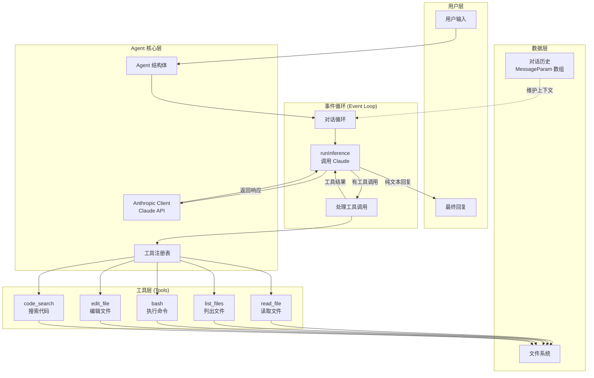
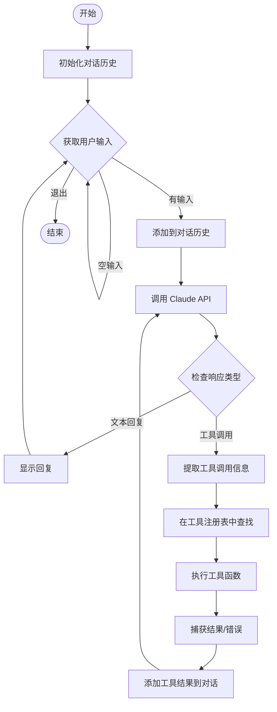
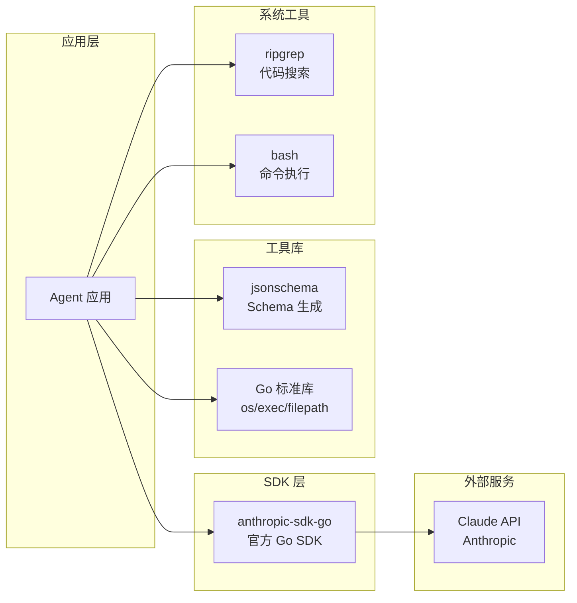

# AI Agent 架构总览：从对话到智能助手

## 一、这个仓库是什么？

这是一个**循序渐进**教你构建 AI Coding Agent 的教学仓库。通过 6 个递进的代码文件，你将从零开始理解现代 AI Agent 的核心架构。

### 核心理念：AI + 工具 = Agent

```
┌─────────────────────────────────────────────────────────────┐
│                                                             │
│     传统聊天机器人          AI Agent                        │
│     ┌───────────┐          ┌───────────┐                   │
│     │  用户输入  │          │  用户输入  │                   │
│     └─────┬─────┘          └─────┬─────┘                   │
│           │                      │                          │
│           ▼                      ▼                          │
│     ┌───────────┐          ┌───────────┐                   │
│     │    LLM    │          │    LLM    │                   │
│     │  (大脑)   │          │  (大脑)   │                   │
│     └─────┬─────┘          └─────┬─────┘                   │
│           │                      │                          │
│           │                      ▼                          │
│           │                ┌───────────┐                   │
│           │                │  工具调用  │ ← 关键区别！      │
│           │                │ (手脚眼睛)│                   │
│           │                └─────┬─────┘                   │
│           │                      │                          │
│           ▼                      ▼                          │
│     ┌───────────┐          ┌───────────┐                   │
│     │  文本回复  │          │  文本回复  │                   │
│     └───────────┘          └───────────┘                   │
│                                                             │
└─────────────────────────────────────────────────────────────┘
```

**关键洞察**：
- **LLM (大语言模型)** = 大脑，负责思考和决策
- **工具 (Tools)** = 手脚眼睛，负责执行具体操作
- **Agent** = LLM + 工具 = 能思考 + 能行动的智能体

---

## 二、整体架构图



---

## 三、六个演进阶段详解

### 阶段对比总览

| 阶段 | 文件 | 新增能力 | 工具数量 | 能做什么 |
|------|------|----------|----------|----------|
| 1 | `chat.go` | 基础对话 | 0 | 普通聊天 |
| 2 | `read.go` | 读文件 | 1 | 查看文件内容 |
| 3 | `list_files.go` | 列目录 | 2 | 浏览文件系统 |
| 4 | `bash_tool.go` | 执行命令 | 3 | 运行 shell 命令 |
| 5 | `edit_tool.go` | 编辑文件 | 4 | 修改/创建文件 |
| 6 | `code_search_tool.go` | 代码搜索 | 4 (替换) | 搜索代码模式 |

### 演进路线图

```
┌─────────────────────────────────────────────────────────────┐
│                      Agent 能力演进                          │
├─────────────────────────────────────────────────────────────┤
│                                                             │
│  Stage 1: chat.go                                          │
│  ┌─────────────────────────────────────┐                   │
│  │  ┌──────┐                           │                   │
│  │  │ 用户 │                           │                   │
│  │  └──┬───┘                           │                   │
│  │     │                               │                   │
│  │     ▼                               │                   │
│  │  ┌──────┐                           │                   │
│  │  │ Claude│ ────────────┐           │                   │
│  │  └──┬───┘             │           │                   │
│  │     │                 ▼           │                   │
│  │     │            【只能聊天】      │                   │
│  │     │                              │                   │
│  └─────┼──────────────────────────────┘                   │
│        │                                                    │
│        ▼                                                    │
│  Stage 2-6: read.go → code_search_tool.go                  │
│  ┌─────────────────────────────────────┐                   │
│  │  ┌──────┐                           │                   │
│  │  │ 用户 │                           │                   │
│  │  └──┬───┘                           │                   │
│  │     │                               │                   │
│  │     ▼                               │                   │
│  │  ┌──────┐                           │                   │
│  │  │ Claude│                          │                   │
│  │  └──┬───┘                           │                   │
│  │     │                               │                   │
│  │     ├───► read_file (看文件)        │                   │
│  │     ├───► list_files (浏览目录)     │                   │
│  │     ├───► bash (执行命令)           │                   │
│  │     ├───► edit_file (修改文件)      │                   │
│  │     └───► code_search (搜索代码)    │                   │
│  │                                     │                   │
│  │  【可以实际操作电脑】                │                   │
│  │                                     │                   │
│  └─────────────────────────────────────┘                   │
│                                                             │
└─────────────────────────────────────────────────────────────┘
```

---

## 四、核心数据结构

### 1. Agent 结构体

```go
type Agent struct {
    client         *anthropic.Client        // Claude API 客户端
    getUserMessage func() (string, bool)    // 获取用户输入的函数
    tools          []ToolDefinition         // 工具定义列表
    verbose        bool                     // 是否详细日志
}
```

**设计思想**：
- `client`: 与 LLM 通信的桥梁
- `getUserMessage`: 函数式设计，方便测试时注入模拟输入
- `tools`: 可插拔的工具系统
- `verbose`: 调试开关

### 2. ToolDefinition 工具定义

```go
type ToolDefinition struct {
    Name        string                                    // 工具名称
    Description string                                    // 工具描述（给 LLM 看的）
    InputSchema anthropic.ToolInputSchemaParam           // 输入参数的 JSON Schema
    Function    func(input json.RawMessage) (string, error)  // 实际执行的函数
}
```

**这是 Agent 工具系统的核心抽象**：
- LLM 通过 Name + Description + InputSchema 理解如何使用工具
- Function 是真正执行操作的代码

### 3. 对话历史管理

```go
conversation := []anthropic.MessageParam{}
```

**为什么需要维护对话历史？**
```
┌────────────────────────────────────────────────┐
│              对话历史的作用                      │
├────────────────────────────────────────────────┤
│                                                │
│  第1轮: 用户: "读取 fizzbuzz.js"               │
│         Claude: [调用 read_file 工具]          │
│         结果: [文件内容]                        │
│         Claude: "文件内容是..."                │
│                                                │
│  第2轮: 用户: "在文件开头加个注释"              │
│         ↑                                      │
│         │ Claude 需要知道上下文：               │
│         │ - 哪个文件？(第1轮提到的)            │
│         │ - 文件当前是什么样？(第1轮读过的)     │
│         │                                      │
│         如果不保存历史，Claude 就会忘记！       │
│                                                │
└────────────────────────────────────────────────┘
```

---

## 五、事件循环 (Event Loop) 详解

### 流程图



### 伪代码解析

```python
# 事件循环的核心逻辑
def run_event_loop():
    conversation = []  # 对话历史
    
    while True:
        # 1. 获取用户输入
        user_input = get_user_message()
        if not user_input:
            continue
        
        # 2. 添加到对话历史
        conversation.append(user_message)
        
        # 3. 调用 LLM
        response = call_claude(conversation)
        
        # 4. 处理响应
        while True:
            tool_calls = extract_tool_calls(response)
            
            if not tool_calls:
                # 纯文本回复，显示给用户
                display(response.text)
                break
            
            # 5. 执行所有工具调用
            tool_results = []
            for tool_call in tool_calls:
                result = execute_tool(tool_call)
                tool_results.append(result)
            
            # 6. 将工具结果发回 LLM
            conversation.append(tool_results)
            response = call_claude(conversation)
```

---

## 六、工具调用机制

### 工具调用的完整流程

```
┌─────────────────────────────────────────────────────────────┐
│                    工具调用时序图                            │
├─────────────────────────────────────────────────────────────┤
│                                                             │
│  用户         Agent         Claude        工具函数          │
│   │            │             │              │               │
│   │ "读取      │             │              │               │
│   │  foo.txt"  │             │              │               │
│   │───────────>│             │              │               │
│   │            │  API 调用   │              │               │
│   │            │────────────>│              │               │
│   │            │             │              │               │
│   │            │             │ 分析意图     │               │
│   │            │             │ 决定调用     │               │
│   │            │             │ read_file    │               │
│   │            │             │              │               │
│   │            │  响应:      │              │               │
│   │            │  tool_use:  │              │               │
│   │            │  read_file  │              │               │
│   │            │  {"path":   │              │               │
│   │            │   "foo.txt"}│              │               │
│   │            │<────────────│              │               │
│   │            │             │              │               │
│   │            │ 执行工具    │              │               │
│   │            │────────────────────────────>│               │
│   │            │             │              │ 读取文件      │
│   │            │             │              │ 返回内容      │
│   │            │<────────────────────────────│               │
│   │            │             │              │               │
│   │            │  发送工具结果│              │               │
│   │            │────────────>│              │               │
│   │            │             │              │               │
│   │            │             │ 生成最终回复 │               │
│   │            │             │              │               │
│   │            │  "文件内容  │              │               │
│   │            │   是..."    │              │               │
│   │            │<────────────│              │               │
│   │            │             │              │               │
│   │ "文件内容  │             │              │               │
│   │  是..."    │             │              │               │
│   │<───────────│             │              │               │
│   │            │             │              │               │
└─────────────────────────────────────────────────────────────┘
```

### 工具输入输出的 JSON Schema 机制

```go
// 1. 定义输入结构体
type ReadFileInput struct {
    Path string `json:"path" jsonschema_description:"文件路径"`
}

// 2. 自动生成 JSON Schema
var ReadFileInputSchema = GenerateSchema[ReadFileInput]()
// 生成的 Schema:
// {
//   "properties": {
//     "path": {
//       "description": "文件路径",
//       "type": "string"
//     }
//   },
//   "required": ["path"]
// }

// 3. Claude 根据 Schema 构造参数
// Claude 返回: {"path": "fizzbuzz.js"}

// 4. 解析参数并执行
func ReadFile(input json.RawMessage) (string, error) {
    var readFileInput ReadFileInput
    json.Unmarshal(input, &readFileInput)
    
    content, err := os.ReadFile(readFileInput.Path)
    return string(content), err
}
```

---

## 七、关键设计模式

### 1. 可插拔工具系统

```
┌─────────────────────────────────────────────────────────────┐
│                   工具注册表模式                             │
├─────────────────────────────────────────────────────────────┤
│                                                             │
│  ┌─────────────────────────────────────────┐               │
│  │           Tool Registry                 │               │
│  │                                         │               │
│  │  tools = []ToolDefinition{              │               │
│  │      ReadFileDefinition,    ← 插件1     │               │
│  │      ListFilesDefinition,   ← 插件2     │               │
│  │      BashDefinition,        ← 插件3     │               │
│  │      EditFileDefinition,    ← 插件4     │               │
│  │  }                                      │               │
│  │                                         │               │
│  │  添加新工具只需:                         │               │
│  │  tools = append(tools, NewTool)         │               │
│  │                                         │               │
│  └─────────────────────────────────────────┘               │
│                                                             │
│  优点:                                                      │
│  ✓ 职责分离：每个工具独立定义                              │
│  ✓ 易于扩展：添加新工具不影响核心代码                      │
│  ✓ 易于测试：可以只测试单个工具                            │
│                                                             │
└─────────────────────────────────────────────────────────────┘
```

### 2. 依赖注入 (Dependency Injection)

```go
// 通过函数参数注入依赖
func NewAgent(
    client *anthropic.Client,              // 注入 API 客户端
    getUserMessage func() (string, bool),  // 注入输入函数
    tools []ToolDefinition,                // 注入工具列表
    verbose bool,
) *Agent {
    return &Agent{
        client:         client,
        getUserMessage: getUserMessage,
        tools:          tools,
        verbose:        verbose,
    }
}

// 好处：测试时可以注入 mock
func TestAgent() {
    mockInput := func() (string, bool) {
        return "test input", true
    }
    agent := NewAgent(mockClient, mockInput, tools, true)
}
```

### 3. 错误处理策略

```
┌─────────────────────────────────────────────────────────────┐
│                    错误处理流程                              │
├─────────────────────────────────────────────────────────────┤
│                                                             │
│  工具执行失败时:                                            │
│                                                             │
│  ┌──────────┐                                              │
│  │ 执行工具 │                                              │
│  └────┬─────┘                                              │
│       │                                                    │
│       ▼                                                    │
│  ┌──────────┐    是     ┌────────────────────┐            │
│  │ 有错误？ │──────────>│ 返回错误信息给 Claude │            │
│  └────┬─────┘           │ (is_error: true)    │            │
│       │ 否              └──────────┬─────────┘            │
│       ▼                            │                      │
│  ┌──────────┐                      │                      │
│  │ 返回结果 │                      ▼                      │
│  └──────────┘           ┌────────────────────┐            │
│                         │ Claude 看到错误后   │            │
│                         │ 可以:              │            │
│                         │ 1. 重试             │            │
│                         │ 2. 告诉用户         │            │
│                         │ 3. 换个方法         │            │
│                         └────────────────────┘            │
│                                                             │
│  示例:                                                      │
│  用户: "读取不存在的文件 xyz.txt"                           │
│  Claude: [调用 read_file("xyz.txt")]                       │
│  工具: [错误: 文件不存在]                                   │
│  Claude: "抱歉，文件 xyz.txt 不存在..."                    │
│                                                             │
└─────────────────────────────────────────────────────────────┘
```

---

## 八、技术栈分析

### 依赖关系图



### 关键技术选型理由

| 技术 | 用途 | 为什么选它 |
|------|------|-----------|
| Go | 主语言 | 简洁、并发友好、编译快 |
| anthropic-sdk-go | Claude API | 官方 SDK，类型安全 |
| jsonschema | Schema 生成 | 自动从 Go struct 生成 JSON Schema |
| ripgrep | 代码搜索 | 比 grep 快 10-100 倍 |

---

## 九、与生产级 Agent 的差距

```
┌─────────────────────────────────────────────────────────────┐
│                这个教学仓库        vs        生产级 Agent    │
├─────────────────────────────────────────────────────────────┤
│                                                             │
│  ✓ 已实现:                                    │
│    - 基础对话循环                                           │
│    - 工具调用机制                                           │
│    - 多工具支持                                             │
│    - 错误处理                                               │
│    - 对话历史管理                                           │
│                                                             │
│  ✗ 未实现 (生产级需要):                                     │
│    - 安全沙箱 (限制危险命令)                                │
│    - 并发控制 (多个工具同时执行)                            │
│    - 流式响应 (实时显示输出)                                │
│    - 持久化存储 (保存对话/状态)                             │
│    - 多模态支持 (图片/文件上传)                             │
│    - 工具链/工作流 (工具组合)                               │
│    - 上下文压缩 (处理长对话)                                │
│    - 多模型支持 (切换不同 LLM)                              │
│    - 监控/日志 (生产环境可观测性)                           │
│    - 用户认证/权限控制                                      │
│                                                             │
└─────────────────────────────────────────────────────────────┘
```

---

## 十、学习建议

### 推荐学习路径

```
Week 1: 理解基础
├── 运行 chat.go，理解基本对话
├── 阅读 runInference 源码
└── 理解 MessageParam 结构

Week 2: 工具系统
├── 运行 read.go，添加断点调试
├── 理解 ToolDefinition 结构
├── 尝试自己写一个简单工具
└── 理解 JSON Schema 生成机制

Week 3: 进阶功能
├── 分析 edit_tool.go 的文件操作
├── 理解错误处理流程
└── 尝试添加一个新工具

Week 4: 深入理解
├── 分析事件循环的完整流程
├── 理解对话历史管理
└── 思考如何扩展成生产级系统
```

### 调试技巧

```bash
# 1. 使用 verbose 模式查看详细日志
go run bash_tool.go --verbose

# 2. 添加断点调试
# 在关键函数添加 fmt.Printf 或 log.Printf

# 3. 测试单个工具
# 可以单独运行工具函数，不通过 Agent
```

---

## 总结

这个仓库展示了现代 AI Agent 的**核心架构**：

1. **LLM 是大脑** - 负责理解和决策
2. **工具是手脚** - 负责执行具体操作
3. **事件循环是心跳** - 协调一切运转
4. **对话历史是记忆** - 保持上下文连贯

理解了这些，你就掌握了构建 AI Agent 的基础！
