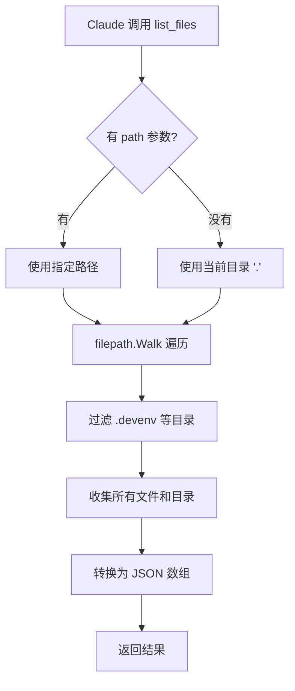
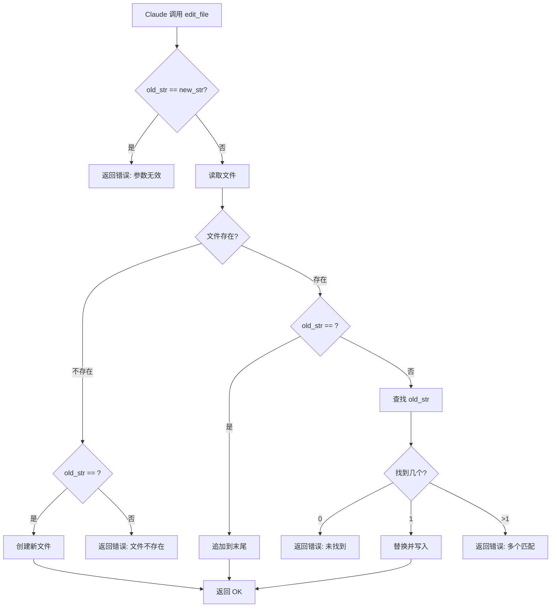

# AI Agent 工具系统详解

## 一、工具系统概述

### 什么是工具？

在 AI Agent 中，**工具 (Tool)** 是 LLM 与外部世界交互的桥梁。

```
┌─────────────────────────────────────────────────────────────┐
│                      工具的作用                              │
├─────────────────────────────────────────────────────────────┤
│                                                             │
│     没有 tools 的 Claude          有 tools 的 Claude        │
│     ┌─────────────┐              ┌─────────────┐           │
│     │  "读取文件  │              │  "读取文件  │           │
│     │   foo.txt"  │              │   foo.txt"  │           │
│     └──────┬──────┘              └──────┬──────┘           │
│            │                            │                   │
│            ▼                            ▼                   │
│     ┌─────────────┐              ┌─────────────┐           │
│     │ "抱歉，我无 │              │ [调用工具]  │           │
│     │ 法访问文件  │              │ read_file   │           │
│     │ 系统..."    │              └──────┬──────┘           │
│     └─────────────┘                     │                   │
│                                         ▼                   │
│                                  ┌─────────────┐           │
│                                  │ 读取实际文件│           │
│                                  │ 返回内容    │           │
│                                  └──────┬──────┘           │
│                                         │                   │
│                                         ▼                   │
│                                  ┌─────────────┐           │
│                                  │ "文件内容是 │           │
│                                  │  Hello..."  │           │
│                                  └─────────────┘           │
│                                                             │
└─────────────────────────────────────────────────────────────┘
```

### 工具系统的三个核心要素

```go
type ToolDefinition struct {
    Name        string                                    // 1. 身份标识
    Description string                                    // 2. 使用说明
    InputSchema anthropic.ToolInputSchemaParam           // 3. 参数规范
    Function    func(input json.RawMessage) (string, error)  // 4. 执行逻辑
}
```

---

## 二、五个工具详解

### 工具能力矩阵

| 工具 | 能力 | 输入参数 | 返回结果 | 使用场景 |
|------|------|----------|----------|----------|
| read_file | 读文件 | path | 文件内容 | 查看代码、配置文件 |
| list_files | 列目录 | path? | 文件列表 | 浏览项目结构 |
| bash | 执行命令 | command | 命令输出 | 运行测试、git 操作 |
| edit_file | 编辑文件 | path, old_str, new_str | OK/error | 修改代码、创建文件 |
| code_search | 搜索代码 | pattern, path?, file_type? | 匹配结果 | 查找函数、变量 |

---

### 1. read_file - 文件读取工具

#### 定义

```go
var ReadFileDefinition = ToolDefinition{
    Name:        "read_file",
    Description: "Read the contents of a given relative file path. Use this when you want to see what's inside a file. Do not use this with directory names.",
    InputSchema: ReadFileInputSchema,
    Function:    ReadFile,
}
```

#### 参数结构

```go
type ReadFileInput struct {
    Path string `json:"path" jsonschema_description:"The relative path of a file in the working directory."`
}
```

#### 执行流程

```
┌─────────────────────────────────────────────────────────────┐
│                   read_file 执行流程                         │
├─────────────────────────────────────────────────────────────┤
│                                                             │
│  Claude 决定调用 read_file                                  │
│       │                                                     │
│       ▼                                                     │
│  ┌────────────────────────────────┐                        │
│  │ 构造参数:                       │                        │
│  │ {                              │                        │
│  │   "path": "fizzbuzz.js"        │                        │
│  │ }                              │                        │
│  └────────────┬───────────────────┘                        │
│               │                                             │
│               ▼                                             │
│  ┌────────────────────────────────┐                        │
│  │ 解析 JSON 到 ReadFileInput     │                        │
│  │ readFileInput.Path = "fizz..." │                        │
│  └────────────┬───────────────────┘                        │
│               │                                             │
│               ▼                                             │
│  ┌────────────────────────────────┐                        │
│  │ os.ReadFile(path)              │                        │
│  │ 读取文件系统                    │                        │
│  └────────────┬───────────────────┘                        │
│               │                                             │
│        ┌──────┴──────┐                                     │
│        │             │                                     │
│        ▼             ▼                                     │
│   ┌────────┐    ┌────────┐                                │
│   │ 成功   │    │ 失败   │                                │
│   │返回内容│    │返回错误│                                │
│   └────────┘    └────────┘                                │
│                                                             │
└─────────────────────────────────────────────────────────────┘
```

#### 实现代码

```go
func ReadFile(input json.RawMessage) (string, error) {
    // 1. 解析输入参数
    readFileInput := ReadFileInput{}
    err := json.Unmarshal(input, &readFileInput)
    if err != nil {
        panic(err)  // 参数格式错误，直接 panic
    }

    // 2. 记录日志
    log.Printf("Reading file: %s", readFileInput.Path)
    
    // 3. 读取文件
    content, err := os.ReadFile(readFileInput.Path)
    if err != nil {
        log.Printf("Failed to read file %s: %v", readFileInput.Path, err)
        return "", err  // 文件读取错误，返回 error
    }
    
    // 4. 返回文件内容
    log.Printf("Successfully read file %s (%d bytes)", readFileInput.Path, len(content))
    return string(content), nil
}
```

#### 使用示例

```
用户: "看看 fizzbuzz.js 里有什么"

Claude 思考:
  用户想看文件内容 → 我有 read_file 工具 → 调用它

Claude 调用:
  tool_use: read_file
  input: {"path": "fizzbuzz.js"}

工具执行:
  读取 ./fizzbuzz.js
  返回: "for (let i = 1; i <= 100; i++) {...}"

Claude 回复:
  "这个文件实现了一个 FizzBuzz 程序..."
```

---

### 2. list_files - 目录列表工具

#### 定义

```go
var ListFilesDefinition = ToolDefinition{
    Name:        "list_files",
    Description: "List files and directories at a given path. If no path is provided, lists files in the current directory.",
    InputSchema: ListFilesInputSchema,
    Function:    ListFiles,
}
```

#### 参数结构

```go
type ListFilesInput struct {
    Path string `json:"path,omitempty" jsonschema_description:"Optional relative path to list files from. Defaults to current directory if not provided."`
}
```

**注意 `omitempty`**: 这个参数是可选的

#### 执行流程



#### 实现代码（bash_tool.go 版本）

```go
func ListFiles(input json.RawMessage) (string, error) {
    // 1. 解析输入
    listFilesInput := ListFilesInput{}
    err := json.Unmarshal(input, &listFilesInput)
    if err != nil {
        panic(err)
    }

    // 2. 确定目录
    dir := "."
    if listFilesInput.Path != "" {
        dir = listFilesInput.Path
    }

    log.Printf("Listing files in directory: %s", dir)
    
    // 3. 遍历目录
    var files []string
    err = filepath.Walk(dir, func(path string, info os.FileInfo, err error) error {
        if err != nil {
            return err
        }

        // 获取相对路径
        relPath, err := filepath.Rel(dir, path)
        if err != nil {
            return err
        }

        // 跳过 .devenv 目录
        if info.IsDir() && (relPath == ".devenv" || strings.HasPrefix(relPath, ".devenv/")) {
            return filepath.SkipDir
        }

        // 添加到列表（目录加 / 后缀）
        if relPath != "." {
            if info.IsDir() {
                files = append(files, relPath+"/")
            } else {
                files = append(files, relPath)
            }
        }
        return nil
    })

    if err != nil {
        return "", err
    }

    // 4. 返回 JSON 数组
    result, _ := json.Marshal(files)
    return string(result), nil
}
```

#### 返回值示例

```json
[
    "AGENT.md",
    "Makefile",
    "README.md",
    "bash_tool.go",
    "chat.go",
    "code_search_tool.go",
    "devenv.lock",
    "devenv.nix",
    "devenv.yaml",
    "edit_tool.go",
    "go.mod",
    "go.sum",
    "list_files.go",
    "prompts/",
    "read.go",
    "riddle.txt"
]
```

---

### 3. bash - 命令执行工具

#### 定义

```go
var BashDefinition = ToolDefinition{
    Name:        "bash",
    Description: "Execute a bash command and return its output. Use this to run shell commands.",
    InputSchema: BashInputSchema,
    Function:    Bash,
}
```

#### 参数结构

```go
type BashInput struct {
    Command string `json:"command" jsonschema_description:"The bash command to execute."`
}
```

#### 执行流程

```
┌─────────────────────────────────────────────────────────────┐
│                    bash 工具执行流程                         │
├─────────────────────────────────────────────────────────────┤
│                                                             │
│  Claude: "运行 git status"                                  │
│       │                                                     │
│       ▼                                                     │
│  ┌──────────────────────────────┐                          │
│  │ input: {"command": "git status"}│                        │
│  └────────────┬─────────────────┘                          │
│               │                                             │
│               ▼                                             │
│  ┌──────────────────────────────┐                          │
│  │ exec.Command("bash", "-c", cmd)│                         │
│  │ 相当于在终端执行: bash -c "git status"│                   │
│  └────────────┬─────────────────┘                          │
│               │                                             │
│               ▼                                             │
│  ┌──────────────────────────────┐                          │
│  │ cmd.CombinedOutput()         │                          │
│  │ 捕获 stdout + stderr          │                          │
│  └────────────┬─────────────────┘                          │
│               │                                             │
│        ┌──────┴──────┐                                     │
│        │             │                                     │
│        ▼             ▼                                     │
│   ┌────────┐    ┌────────────────────┐                    │
│   │ 成功   │    │ 失败 (exit code ≠ 0)│                    │
│   │返回输出│    │ 返回错误信息+输出   │                    │
│   └────────┘    └────────────────────┘                    │
│                                                             │
│  注意: 即使命令失败，也返回结果而不是 error                │
│  这样 Claude 可以看到错误信息并尝试修复                    │
│                                                             │
└─────────────────────────────────────────────────────────────┘
```

#### 实现代码

```go
func Bash(input json.RawMessage) (string, error) {
    // 1. 解析输入
    bashInput := BashInput{}
    err := json.Unmarshal(input, &bashInput)
    if err != nil {
        return "", err
    }

    log.Printf("Executing bash command: %s", bashInput.Command)
    
    // 2. 构造命令
    cmd := exec.Command("bash", "-c", bashInput.Command)
    
    // 3. 执行并捕获输出
    output, err := cmd.CombinedOutput()
    
    // 4. 处理结果
    if err != nil {
        // 命令失败，但返回输出（不返回 error）
        // 这样 Claude 可以看到错误信息
        return fmt.Sprintf("Command failed with error: %s\nOutput: %s", 
            err.Error(), string(output)), nil
    }

    // 5. 成功，返回输出
    return strings.TrimSpace(string(output)), nil
}
```

**重要设计决策**: 即使命令失败也返回 `nil` error，让 Claude 看到失败信息

#### 使用示例

```
用户: "看看系统有哪些进程"

Claude:
  tool_use: bash
  input: {"command": "ps aux"}

工具执行:
  执行 bash -c "ps aux"
  返回: "USER  PID  %CPU %MEM  COMMAND\n..."

Claude:
  "系统当前运行着以下进程:
   - PID 1: /sbin/launchd
   - PID 42: /usr/sbin/syslogd
   ..."
```

---

### 4. edit_file - 文件编辑工具

#### 定义

```go
var EditFileDefinition = ToolDefinition{
    Name: "edit_file",
    Description: `Make edits to a text file.

Replaces 'old_str' with 'new_str' in the given file. 'old_str' and 'new_str' MUST be different from each other.

If the file specified with path doesn't exist, it will be created.`,
    InputSchema: EditFileInputSchema,
    Function:    EditFile,
}
```

#### 参数结构

```go
type EditFileInput struct {
    Path   string `json:"path" jsonschema_description:"The path to the file"`
    OldStr string `json:"old_str" jsonschema_description:"Text to search for - must match exactly and must only have one match exactly"`
    NewStr string `json:"new_str" jsonschema_description:"Text to replace old_str with"`
}
```

#### 编辑模式

```
┌─────────────────────────────────────────────────────────────┐
│                   edit_file 的三种模式                       │
├─────────────────────────────────────────────────────────────┤
│                                                             │
│  模式 1: 替换现有内容                                       │
│  ┌────────────────────────────────────────┐                │
│  │ old_str: "function hello() {"          │                │
│  │ new_str: "function hello(name) {"      │                │
│  │                                        │                │
│  │ 效果: 精确查找并替换第一个匹配项        │                │
│  └────────────────────────────────────────┘                │
│                                                             │
│  模式 2: 创建新文件                                         │
│  ┌────────────────────────────────────────┐                │
│  │ 文件不存在 + old_str == ""             │                │
│  │ new_str: "console.log('hello')"        │                │
│  │                                        │                │
│  │ 效果: 创建新文件并写入 new_str         │                │
│  └────────────────────────────────────────┘                │
│                                                             │
│  模式 3: 追加到文件末尾                                     │
│  ┌────────────────────────────────────────┐                │
│  │ 文件存在 + old_str == ""               │                │
│  │ new_str: "\n// End of file"            │                │
│  │                                        │                │
│  │ 效果: 在文件末尾追加 new_str           │                │
│  └────────────────────────────────────────┘                │
│                                                             │
└─────────────────────────────────────────────────────────────┘
```

#### 执行流程



#### 实现代码（关键部分）

```go
func EditFile(input json.RawMessage) (string, error) {
    editFileInput := EditFileInput{}
    json.Unmarshal(input, &editFileInput)

    // 1. 参数验证
    if editFileInput.Path == "" || editFileInput.OldStr == editFileInput.NewStr {
        return "", fmt.Errorf("invalid input parameters")
    }

    // 2. 读取文件
    content, err := os.ReadFile(editFileInput.Path)
    if err != nil {
        // 文件不存在，且 old_str 为空 → 创建新文件
        if os.IsNotExist(err) && editFileInput.OldStr == "" {
            return createNewFile(editFileInput.Path, editFileInput.NewStr)
        }
        return "", err
    }

    oldContent := string(content)

    // 3. 处理不同的编辑模式
    var newContent string
    if editFileInput.OldStr == "" {
        // 追加模式
        newContent = oldContent + editFileInput.NewStr
    } else {
        // 替换模式 - 先检查匹配次数
        count := strings.Count(oldContent, editFileInput.OldStr)
        if count == 0 {
            return "", fmt.Errorf("old_str not found in file")
        }
        if count > 1 {
            return "", fmt.Errorf("old_str found %d times, must be unique", count)
        }
        
        // 执行替换
        newContent = strings.Replace(oldContent, editFileInput.OldStr, 
            editFileInput.NewStr, 1)
    }

    // 4. 写入文件
    os.WriteFile(editFileInput.Path, []byte(newContent), 0644)
    return "OK", nil
}
```

#### 使用示例

**示例 1: 创建新文件**

```
用户: "创建一个 hello.js 文件，输出 Hello World"

Claude:
  tool_use: edit_file
  input: {
    "path": "hello.js",
    "old_str": "",
    "new_str": "console.log('Hello World');"
  }

结果: 创建 hello.js 文件
```

**示例 2: 修改现有文件**

```
用户: "在 fizzbuzz.js 的函数定义里加个参数 n"

Claude 先读取文件:
  "function fizzbuzz() { ... }"

Claude:
  tool_use: edit_file
  input: {
    "path": "fizzbuzz.js",
    "old_str": "function fizzbuzz() {",
    "new_str": "function fizzbuzz(n) {"
  }

结果: fizzbuzz.js 的函数签名变为 function fizzbuzz(n) {
```

---

### 5. code_search - 代码搜索工具

#### 定义

```go
var CodeSearchDefinition = ToolDefinition{
    Name: "code_search",
    Description: `Search for code patterns using ripgrep (rg).

Use this to find code patterns, function definitions, variable usage, or any text in the codebase.
You can search by pattern, file type, or directory.`,
    InputSchema: CodeSearchInputSchema,
    Function:    CodeSearch,
}
```

#### 参数结构

```go
type CodeSearchInput struct {
    Pattern       string `json:"pattern" jsonschema_description:"The search pattern or regex to look for"`
    Path          string `json:"path,omitempty" jsonschema_description:"Optional path to search in (file or directory)"`
    FileType      string `json:"file_type,omitempty" jsonschema_description:"Optional file extension to limit search to (e.g., 'go', 'js', 'py')"`
    CaseSensitive bool   `json:"case_sensitive,omitempty" jsonschema_description:"Whether the search should be case sensitive (default: false)"`
}
```

#### 执行流程

```
┌─────────────────────────────────────────────────────────────┐
│                  code_search 执行流程                        │
├─────────────────────────────────────────────────────────────┤
│                                                             │
│  输入:                                                      │
│  {                                                          │
│    "pattern": "func.*Agent",                                │
│    "file_type": "go",                                       │
│    "case_sensitive": true                                   │
│  }                                                          │
│       │                                                     │
│       ▼                                                     │
│  ┌──────────────────────────────────┐                      │
│  │ 构造 ripgrep 命令:                │                      │
│  │ rg --line-number \                │                      │
│  │    --with-filename \              │                      │
│  │    --color=never \                │                      │
│  │    --type go \                    │                      │
│  │    "func.*Agent" .                │                      │
│  └────────────┬─────────────────────┘                      │
│               │                                             │
│               ▼                                             │
│  ┌──────────────────────────────────┐                      │
│  │ 执行 ripgrep (rg)                 │                      │
│  │ 返回匹配结果                      │                      │
│  └────────────┬─────────────────────┘                      │
│               │                                             │
│        ┌──────┴──────┐                                     │
│        │             │                                     │
│        ▼             ▼                                     │
│   ┌────────┐    ┌────────────┐                            │
│   │ 有结果 │    │ 无结果     │                            │
│   │返回匹配│    │返回"No     │                            │
│   │行列表  │    │matches"    │                            │
│   └────────┘    └────────────┘                            │
│                                                             │
└─────────────────────────────────────────────────────────────┘
```

#### 实现代码

```go
func CodeSearch(input json.RawMessage) (string, error) {
    codeSearchInput := CodeSearchInput{}
    json.Unmarshal(input, &codeSearchInput)

    if codeSearchInput.Pattern == "" {
        return "", fmt.Errorf("pattern is required")
    }

    // 1. 构造 ripgrep 命令
    args := []string{"rg", "--line-number", "--with-filename", "--color=never"}

    // 2. 添加可选参数
    if !codeSearchInput.CaseSensitive {
        args = append(args, "--ignore-case")
    }
    
    if codeSearchInput.FileType != "" {
        args = append(args, "--type", codeSearchInput.FileType)
    }

    // 3. 添加搜索模式和路径
    args = append(args, codeSearchInput.Pattern)
    
    if codeSearchInput.Path != "" {
        args = append(args, codeSearchInput.Path)
    } else {
        args = append(args, ".")
    }

    // 4. 执行命令
    cmd := exec.Command(args[0], args[1:]...)
    output, err := cmd.Output()
    
    // 5. 处理结果
    // ripgrep 返回 exit code 1 表示无匹配（不是错误）
    if err != nil {
        if exitError, ok := err.(*exec.ExitError); ok && exitError.ExitCode() == 1 {
            return "No matches found", nil
        }
        return "", fmt.Errorf("search failed: %w", err)
    }

    result := strings.TrimSpace(string(output))
    lines := strings.Split(result, "\n")
    
    // 6. 限制输出长度（防止返回过多结果）
    if len(lines) > 50 {
        result = strings.Join(lines[:50], "\n") + 
            fmt.Sprintf("\n... (showing first 50 of %d matches)", len(lines))
    }
    
    return result, nil
}
```

#### 返回值示例

```
chat.go:20:func NewAgent(client *anthropic.Client, ...) *Agent {
chat.go:26:type Agent struct {
read.go:20:func NewAgent(client *anthropic.Client, ...) *Agent {
read.go:26:type Agent struct {
bash_tool.go:22:func NewAgent(client *anthropic.Client, ...) *Agent {
bash_tool.go:28:type Agent struct {
```

#### 为什么用 ripgrep？

```
┌─────────────────────────────────────────────────────────────┐
│                   ripgrep vs grep                           │
├─────────────────────────────────────────────────────────────┤
│                                                             │
│  ripgrep (rg):                                              │
│  ✓ 速度: 比 grep 快 10-100 倍                              │
│  ✓ 自动忽略 .gitignore 中的文件                            │
│  ✓ 自动跳过隐藏文件和二进制文件                            │
│  ✓ 支持多种文件类型 (--type go, --type js)                 │
│  ✓ 彩色输出                                                 │
│  ✓ Unicode 支持                                             │
│                                                             │
│  基准测试 (搜索 Linux 内核源码):                            │
│  - grep:    1.2 秒                                          │
│  - ripgrep: 0.05 秒                                         │
│                                                             │
└─────────────────────────────────────────────────────────────┘
```

---

## 三、JSON Schema 自动生成

### 为什么需要 JSON Schema？

```
┌─────────────────────────────────────────────────────────────┐
│                  JSON Schema 的作用                          │
├─────────────────────────────────────────────────────────────┤
│                                                             │
│  没有 Schema:                                               │
│  Claude 不知道工具需要什么参数 → 可能乱传参数              │
│                                                             │
│  有 Schema:                                                 │
│  Claude 看到参数规范 → 正确构造参数                        │
│                                                             │
│  示例:                                                      │
│  {                                                          │
│    "properties": {                                          │
│      "path": {                                              │
│        "type": "string",                                    │
│        "description": "文件路径"                            │
│      }                                                      │
│    },                                                       │
│    "required": ["path"]                                     │
│  }                                                          │
│                                                             │
│  Claude 看到后知道:                                         │
│  1. 需要传 path 参数                                        │
│  2. path 必须是字符串                                       │
│  3. path 是必需的                                           │
│                                                             │
└─────────────────────────────────────────────────────────────┘
```

### 自动生成机制

```go
// 1. 定义 Go 结构体
type ReadFileInput struct {
    Path string `json:"path" jsonschema_description:"文件路径"`
}

// 2. 使用泛型函数生成 Schema
func GenerateSchema[T any]() anthropic.ToolInputSchemaParam {
    reflector := jsonschema.Reflector{
        AllowAdditionalProperties: false,
        DoNotReference:            true,
    }
    var v T
    schema := reflector.Reflect(v)
    return anthropic.ToolInputSchemaParam{
        Properties: schema.Properties,
    }
}

var ReadFileInputSchema = GenerateSchema[ReadFileInput]()
```

**工作原理**:

```
Go Struct                     JSON Schema
┌─────────────────┐          ┌─────────────────┐
│ type Input struct│          │ {               │
│   Path string    │  ──────> │   "properties": │
│   `json:"path"`  │          │     "path": {   │
│   `jsonschema_   │          │       "type":   │
│    description:  │          │         "string"│
│    "文件路径"`   │          │     }           │
│ }                │          │   }             │
└─────────────────┘          └─────────────────┘
     反射机制
```

---

## 四、工具调用的完整生命周期

```
┌─────────────────────────────────────────────────────────────┐
│               工具调用完整生命周期                           │
├─────────────────────────────────────────────────────────────┤
│                                                             │
│  时间线:                                                    │
│                                                             │
│  T1: 用户输入                                               │
│  └── "读取 fizzbuzz.js 的内容"                             │
│                                                             │
│  T2: 添加到对话历史                                         │
│  └── conversation = [{role: "user", content: "..."}]       │
│                                                             │
│  T3: 调用 Claude API                                        │
│  └── 包含工具定义的 API 请求                               │
│                                                             │
│  T4: Claude 分析                                            │
│  └── 理解意图 → 决定调用 read_file                         │
│                                                             │
│  T5: Claude 返回工具调用                                    │
│  └── {type: "tool_use", name: "read_file", input: {...}}   │
│                                                             │
│  T6: Agent 提取工具信息                                     │
│  └── toolName = "read_file"                                │
│  └── toolInput = {"path": "fizzbuzz.js"}                   │
│                                                             │
│  T7: 查找工具定义                                           │
│  └── 在 tools 数组中找到 ReadFileDefinition                │
│                                                             │
│  T8: 执行工具函数                                           │
│  └── ReadFile(input) → 返回文件内容                        │
│                                                             │
│  T9: 构造工具结果                                           │
│  └── {type: "tool_result", tool_use_id: "...", content: }  │
│                                                             │
│  T10: 添加到对话历史                                        │
│  └── conversation.append(toolResultMessage)                │
│                                                             │
│  T11: 再次调用 Claude API                                   │
│  └── 包含工具结果的请求                                    │
│                                                             │
│  T12: Claude 生成最终回复                                   │
│  └── "文件 fizzbuzz.js 的内容是..."                        │
│                                                             │
│  T13: 显示给用户                                            │
│  └── 输出 Claude 的文本回复                                │
│                                                             │
└─────────────────────────────────────────────────────────────┘
```

---

## 五、如何添加新工具

### 步骤清单

```
┌─────────────────────────────────────────────────────────────┐
│                  添加新工具的 5 个步骤                       │
├─────────────────────────────────────────────────────────────┤
│                                                             │
│  Step 1: 定义输入结构体                                     │
│  ┌────────────────────────────────────┐                    │
│  │ type MyToolInput struct {          │                    │
│  │     Param1 string `json:"param1"`  │                    │
│  │     Param2 int    `json:"param2"`  │                    │
│  │ }                                  │                    │
│  └────────────────────────────────────┘                    │
│                                                             │
│  Step 2: 生成 Schema                                        │
│  ┌────────────────────────────────────┐                    │
│  │ var MyToolInputSchema =            │                    │
│  │     GenerateSchema[MyToolInput]()  │                    │
│  └────────────────────────────────────┘                    │
│                                                             │
│  Step 3: 实现工具函数                                       │
│  ┌────────────────────────────────────┐                    │
│  │ func MyTool(input json.RawMessage) │                    │
│  │     (string, error) {              │                    │
│  │     // 解析输入                    │                    │
│  │     // 执行操作                    │                    │
│  │     // 返回结果                    │                    │
│  │ }                                  │                    │
│  └────────────────────────────────────┘                    │
│                                                             │
│  Step 4: 创建工具定义                                       │
│  ┌────────────────────────────────────┐                    │
│  │ var MyToolDefinition = ToolDefinition{│                 │
│  │     Name:        "my_tool",        │                    │
│  │     Description: "工具描述...",    │                    │
│  │     InputSchema: MyToolInputSchema,│                    │
│  │     Function:    MyTool,           │                    │
│  │ }                                  │                    │
│  └────────────────────────────────────┘                    │
│                                                             │
│  Step 5: 注册到 Agent                                       │
│  ┌────────────────────────────────────┐                    │
│  │ tools := []ToolDefinition{         │                    │
│  │     ReadFileDefinition,            │                    │
│  │     MyToolDefinition,  // 新增     │                    │
│  │ }                                  │                    │
│  └────────────────────────────────────┘                    │
│                                                             │
└─────────────────────────────────────────────────────────────┘
```

### 示例: 添加一个获取当前时间的工具

```go
// Step 1: 定义输入
type GetTimeInput struct {
    Timezone string `json:"timezone,omitempty" jsonschema_description:"Optional timezone (e.g., 'Asia/Shanghai')"`
}

// Step 2: 生成 Schema
var GetTimeInputSchema = GenerateSchema[GetTimeInput]()

// Step 3: 实现函数
func GetTime(input json.RawMessage) (string, error) {
    getTimeInput := GetTimeInput{}
    json.Unmarshal(input, &getTimeInput)
    
    var loc *time.Location
    var err error
    
    if getTimeInput.Timezone != "" {
        loc, err = time.LoadLocation(getTimeInput.Timezone)
        if err != nil {
            return "", err
        }
    } else {
        loc = time.Local
    }
    
    return time.Now().In(loc).Format(time.RFC3339), nil
}

// Step 4: 创建定义
var GetTimeDefinition = ToolDefinition{
    Name:        "get_time",
    Description: "Get the current time in a specified timezone",
    InputSchema: GetTimeInputSchema,
    Function:    GetTime,
}

// Step 5: 注册
tools := []ToolDefinition{
    ReadFileDefinition,
    GetTimeDefinition,  // 新增
}
```

---

## 六、工具系统的设计原则

### 1. 单一职责

```
每个工具只做一件事:
✓ read_file   - 只读文件
✓ list_files  - 只列目录
✓ bash        - 只执行命令

避免:
✗ file_operations - 既读又写又删除 (太复杂)
```

### 2. 清晰的描述

```
好的描述:
"Read the contents of a given relative file path. 
 Use this when you want to see what's inside a file."

不好的描述:
"Reads files"  (太简单，Claude 不知道什么时候用)
```

### 3. 明确的错误信息

```
好的错误处理:
return "", fmt.Errorf("old_str found %d times, must be unique", count)

Claude 看到后可以:
- 换个更具体的 old_str
- 告诉用户有多个匹配

不好的错误处理:
return "", fmt.Errorf("error")

Claude 不知道发生了什么
```

### 4. 安全性考虑

```
当前实现的安全风险:
- bash 工具可以执行任何命令 (rm -rf /)
- edit_file 可以修改任何文件
- 没有权限检查

生产环境需要:
- 命令白名单
- 文件路径限制
- 用户确认机制
```

---

## 总结

工具系统是 AI Agent 的核心能力，通过本文档你应该理解了:

1. **工具的定义**: Name + Description + Schema + Function
2. **五个工具的实现**: read_file, list_files, bash, edit_file, code_search
3. **JSON Schema 生成**: 从 Go struct 自动生成
4. **工具调用流程**: 从 Claude 决定到执行完成
5. **如何扩展**: 5 步添加新工具
6. **设计原则**: 单一职责、清晰描述、明确错误、安全考虑
